<details>
<summary>Relevant source files</summary>

The following files were used as context for generating this wiki page:

- [app/main.py](app/main.py)
- [app/config/settings.py](app/config/settings.py)
- [app/core/bedrock_client.py](app/core/bedrock_client.py)
- [app/core/database.py](app/core/database.py)
- [app/core/security.py](app/core/security.py)
- [app/core/exceptions.py](app/core/exceptions.py)
- [app/core/logging_config.py](app/core/logging_config.py)
- [app/models/chat.py](app/models/chat.py)
- [app/models/schema_metadata.py](app/models/schema_metadata.py)
- [app/routers/chat.py](app/routers/chat.py)
- [app/routers/health.py](app/routers/health.py)
- [app/services/text_to_sql.py](app/services/text_to_sql.py)
- [app/services/guardrails.py](app/services/guardrails.py)
- [tests/test_guardrails.py](tests/test_guardrails.py)
- [tests/test_integration.py](tests/test_integration.py)
- [tests/conftest.py](tests/conftest.py)
- [Dockerfile](Dockerfile)
- [docker-compose.yml](docker-compose.yml)
- [requirements.txt](requirements.txt)
- [bitbucket-pipelines.yml](bitbucket-pipelines.yml)
- [task-definition.json](task-definition.json)
</details>

# Chatbot Assistant Backend — Wiki Técnica Completa

## Introducción

**Chatbot Assistant Backend** es una API REST construida con **FastAPI** que permite a los usuarios realizar consultas en lenguaje natural sobre una base de datos de procesamiento de pagos (ATM cashless y PIN debit). El sistema convierte automáticamente preguntas en español a consultas SQL válidas utilizando **AWS Bedrock** (Claude 3.5 Sonnet) a través de **LangChain**, ejecuta las consultas de forma segura contra una base de datos **MySQL**, y devuelve tanto los resultados estructurados como una respuesta en lenguaje natural.

El proyecto implementa un robusto sistema de **guardrails** (barreras de seguridad) que protege datos sensibles, previene inyección SQL, y asegura que solo se ejecuten consultas de lectura autorizadas. Está diseñado para desplegarse en **AWS ECS Fargate** con un pipeline CI/CD integrado con Bitbucket Pipelines.

Sources: [app/main.py:1-22](), [app/config/settings.py:1-38](), [requirements.txt:1-18]()

---

## Arquitectura General del Sistema

El siguiente diagrama muestra la arquitectura de alto nivel del sistema, desde el cliente hasta los servicios externos:

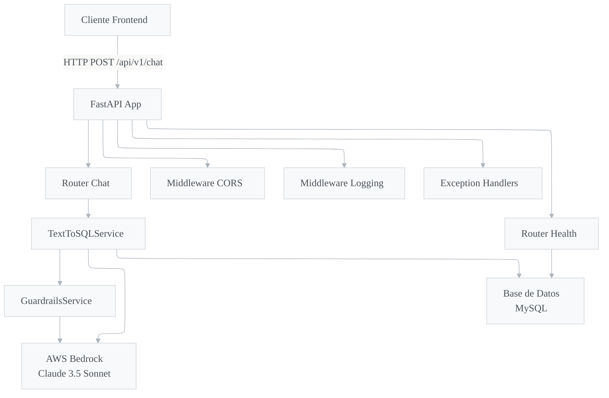

Sources: [app/main.py:20-128](), [app/routers/chat.py:1-67](), [app/routers/health.py:1-54]()

### Flujo Completo de una Solicitud

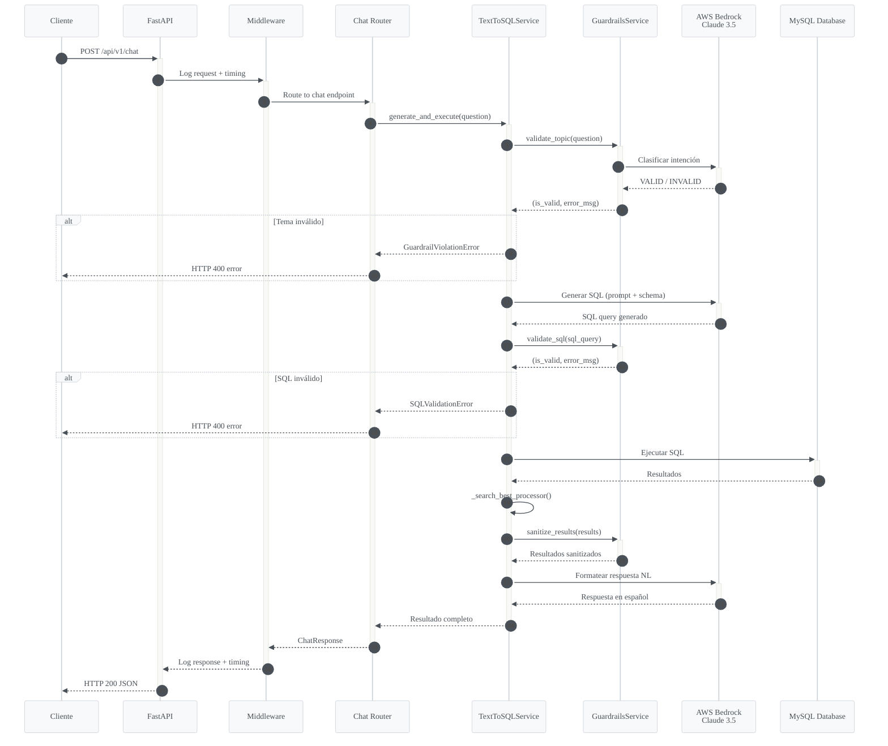

Sources: [app/services/text_to_sql.py:88-134](), [app/routers/chat.py:30-67](), [app/main.py:80-112]()

---

## Estructura del Proyecto

```
chatbot-assistant-backend-tf/
├── app/
│   ├── __init__.py
│   ├── main.py                    # Aplicación FastAPI, middlewares, handlers
│   ├── config/
│   │   └── settings.py            # Configuración con Pydantic Settings
│   ├── core/
│   │   ├── bedrock_client.py      # Cliente directo AWS Bedrock
│   │   ├── database.py            # Conexión SQLAlchemy a MySQL
│   │   ├── exceptions.py          # Excepciones personalizadas
│   │   ├── logging_config.py      # Logging estructurado JSON
│   │   └── security.py            # Validación JWT
│   ├── models/
│   │   ├── chat.py                # Modelos Pydantic request/response
│   │   └── schema_metadata.py     # Metadatos del esquema de BD
│   ├── routers/
│   │   ├── chat.py                # Endpoint principal de chat
│   │   └── health.py              # Health check
│   └── services/
│       ├── guardrails.py          # Validación de seguridad
│       └── text_to_sql.py         # Conversión Text-to-SQL
├── tests/
│   ├── conftest.py                # Fixtures de pytest
│   ├── test_guardrails.py         # Tests unitarios de guardrails
│   └── test_integration.py        # Tests de integración del endpoint
├── Dockerfile                      # Build multi-stage
├── docker-compose.yml             # Orquestación local
├── requirements.txt               # Dependencias Python
├── bitbucket-pipelines.yml        # CI/CD pipeline
└── task-definition.json           # Definición de tarea ECS Fargate
```

Sources: [Dockerfile:1-46](), [docker-compose.yml:1-52](), [requirements.txt:1-18]()

---

## Configuración

### Variables de Entorno

La configuración se centraliza en la clase `Settings` que hereda de `BaseSettings` de Pydantic, cargando automáticamente valores desde variables de entorno o un archivo `.env`.

| Variable | Tipo | Default | Descripción |
|---|---|---|---|
| `PROJECT_NAME` | `str` | `"Chatbot Assistant API"` | Nombre del proyecto |
| `API_V1_STR` | `str` | `"/api/v1"` | Prefijo de la API |
| `DB_HOST` | `str` | *requerido* | Host de la base de datos MySQL |
| `DB_USER` | `str` | *requerido* | Usuario de la base de datos |
| `DB_PASSWORD` | `str` | *requerido* | Contraseña de la base de datos |
| `DB_NAME` | `str` | *requerido* | Nombre de la base de datos |
| `DB_PORT` | `int` | `3306` | Puerto de la base de datos |
| `AWS_ACCESS_KEY_ID` | `str` | *requerido* | Clave de acceso AWS |
| `AWS_SECRET_ACCESS_KEY` | `str` | *requerido* | Clave secreta AWS |
| `AWS_REGION` | `str` | `"us-east-1"` | Región de AWS |
| `BEDROCK_MODEL_ID` | `str` | `"anthropic.claude-3-5-sonnet-20241022-v2:0"` | Modelo de Bedrock |
| `SECRET_KEY` | `str` | *requerido* | Clave secreta compartida para JWT |
| `ALGORITHM` | `str` | `"HS256"` | Algoritmo de JWT |
| `ACCESS_TOKEN_EXPIRE_MINUTES` | `int` | `30` | Expiración del token |
| `BACKEND_CORS_ORIGINS` | `List[str]` | `["http://localhost:4200", "http://localhost:3000"]` | Orígenes CORS permitidos |
| `LOG_LEVEL` | `str` | `"INFO"` | Nivel de logging |

Sources: [app/config/settings.py:1-38]()

---

## Capa de API (Routers)

### Endpoint de Chat (`POST /api/v1/chat/`)

El endpoint principal recibe preguntas en lenguaje natural y devuelve respuestas estructuradas junto con la consulta SQL generada.

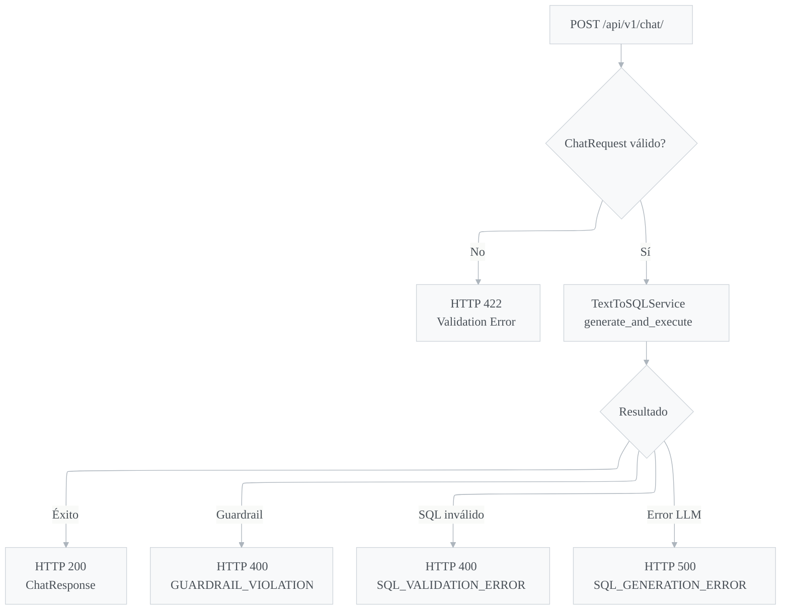

**Modelo de Request (`ChatRequest`):**

| Campo | Tipo | Requerido | Descripción |
|---|---|---|---|
| `message` | `str` | Sí | Pregunta en lenguaje natural |
| `session_id` | `str` | No | ID de sesión (se genera automáticamente si no se proporciona) |
| `context` | `Dict[str, Any]` | No | Contexto adicional de filtrado |

**Modelo de Response (`ChatResponse`):**

| Campo | Tipo | Descripción |
|---|---|---|
| `session_id` | `str` | Identificador de sesión |
| `message` | `str` | Respuesta en lenguaje natural |
| `data` | `List[Dict]` | Resultados de la consulta (datos estructurados) |
| `query_executed` | `str` | Consulta SQL que se ejecutó |
| `response_time_ms` | `float` | Tiempo de respuesta en milisegundos |

El servicio se instancia como singleton para reutilizar las conexiones LLM y de base de datos entre solicitudes.

Sources: [app/models/chat.py:1-20](), [app/routers/chat.py:1-67]()

### Endpoint de Health Check (`GET /api/v1/health/`)

Verifica el estado de la API y sus dependencias, incluyendo la conectividad con la base de datos.

| Servicio | Verificación | Estado posible |
|---|---|---|
| `database` | `SELECT 1` contra MySQL | `healthy` / `unhealthy` |
| `bedrock` | Solo verifica configuración (sin llamada real) | `configured` |

Devuelve HTTP 200 si todo está saludable, HTTP 503 si hay degradación.

Sources: [app/routers/health.py:1-54]()

---

## Servicio Text-to-SQL

El componente central del sistema es `TextToSQLService`, que orquesta la conversión de lenguaje natural a SQL y la ejecución segura de consultas.

### Pipeline de Procesamiento

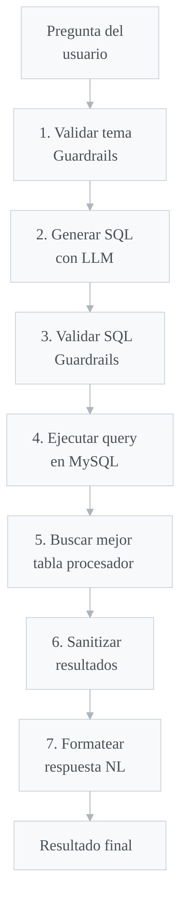

Sources: [app/services/text_to_sql.py:88-134]()

### Inicialización

El servicio inicializa tres componentes principales:

1. **LLM (ChatBedrock):** Claude 3.5 Sonnet con temperatura 0.1 para respuestas determinísticas
2. **SQLDatabase:** Conexión LangChain para ejecución de consultas
3. **GuardrailsService:** Validación de seguridad con referencia al LLM

```python
self.llm = ChatBedrock(
    model_id=settings.BEDROCK_MODEL_ID,
    region_name=settings.AWS_REGION,
    model_kwargs={
        "temperature": 0.1,
        "top_p": 0.9,
        "max_tokens": 4096,
    }
)
```

Sources: [app/services/text_to_sql.py:62-85]()

### Generación de SQL (`_generate_sql`)

El método construye un prompt detallado en español que incluye:

- El **esquema completo** de la base de datos generado dinámicamente desde `SCHEMA_METADATA`
- **Reglas estrictas** de seguridad (solo SELECT, sin UNION, sin subconsultas)
- **Instrucciones de resolución de nombres** para buscar clientes por nombre comercial (`dba_name`)
- **Cadena de JOINs** para vincular transacciones individuales a clientes a través de `simple_terminals` → `terminal_states_tids` → `customers`
- **Ejemplos few-shot** de consultas correctas extraídos de `QUERY_EXAMPLES`
- Lista de **columnas protegidas** y **tablas permitidas**

El prompt instruye al LLM a elegir entre tablas de resumen (`customer_transactions`, `hardware_transactions`) o tablas de procesador individual dependiendo del tipo de pregunta.

Sources: [app/services/text_to_sql.py:328-430](), [app/models/schema_metadata.py:298-356]()

### Extracción y Limpieza de SQL

El servicio implementa tres estrategias progresivas para extraer SQL puro de la respuesta del LLM:

1. **Markdown code block:** Extrae de bloques ` ```sql ... ``` `
2. **Respuesta directa:** Si comienza con `SELECT`, toma toda la respuesta
3. **Búsqueda de SELECT:** Encuentra la primera instancia de `SELECT` en el texto

Adicionalmente, `_clean_sql` elimina punto y coma finales y artefactos de markdown.

Sources: [app/services/text_to_sql.py:432-475]()

### Búsqueda Inteligente de Procesadores (`_search_best_processor`)

Para consultas sobre tablas de procesador (transacciones individuales), el sistema implementa una lógica de búsqueda inteligente:

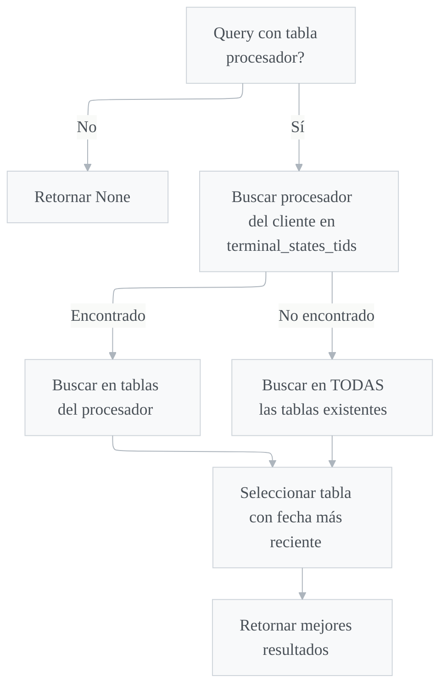

Las tablas de procesador disponibles son:

| Tabla | Descripción |
|---|---|
| `processor4s` | Transacciones cashless (Processor 4) |
| `processor5s` | Transacciones cashless (Processor 5) |
| `processor6s` | Transacciones PIN debit (Processor 6) |
| `processor7s` | Transacciones gateway (Processor 7) |
| `columbus` | Transacciones Columbus |
| `switch_transaction_b` | Transacciones Switch |
| `asais` | Transacciones ASAI |

El mapeo entre el valor de `terminal_states_tids.processor` y la tabla real se define en `PROCESSOR_TO_TABLE`:

```python
PROCESSOR_TO_TABLE = {
    "processor4": "processor4s",
    "processor5": "processor5s",
    "processor6": "processor6s",
    "processor7": "processor7s",
    "columbus": "columbus",
    "switch_transaction": "switch_transaction_b",
    "asai": "asais",
}
```

Sources: [app/services/text_to_sql.py:136-210](), [app/services/text_to_sql.py:211-222]()

### Ejecución de Consultas

El método `_execute_query` utiliza `SQLDatabase.run()` de LangChain con `fetch="cursor"` para obtener un objeto cursor real con nombres de columna, convirtiendo los resultados a una lista de diccionarios. Incluye fallbacks para manejar resultados string (parseados con `ast.literal_eval`) y listas ya formateadas.

Sources: [app/services/text_to_sql.py:477-534]()

### Formateo de Respuesta en Lenguaje Natural

Para conjuntos pequeños de resultados (≤10 filas), se utiliza el LLM para generar una respuesta concisa en español. Las instrucciones incluyen:
- Responder en máximo 3 oraciones
- No incluir SQL ni detalles técnicos
- Formatear montos con separadores de miles
- Mencionar valores NULL cuando aplique

Para conjuntos grandes (>10 filas), se retorna un mensaje genérico indicando la cantidad de resultados.

Sources: [app/services/text_to_sql.py:536-573]()

---

## Sistema de Guardrails (Seguridad)

El `GuardrailsService` implementa múltiples capas de protección para prevenir acceso no autorizado a datos sensibles y ataques de inyección SQL.

### Arquitectura de Validaciones

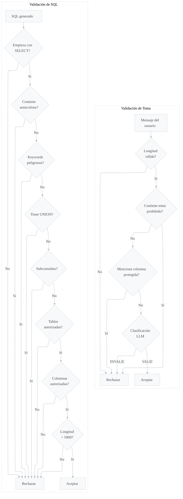

Sources: [app/services/guardrails.py:1-195]()

### Validación de Tema (`validate_topic`)

| Capa | Verificación | Respuesta en caso de fallo |
|---|---|---|
| Longitud máxima | `len(message) > 1000` | "Tu mensaje es demasiado largo" |
| Longitud mínima | `len(message.strip()) < 5` | "Tu mensaje es demasiado corto" |
| Temas prohibidos | Política, religión, contraseñas, etc. | "No puedo ayudarte con preguntas sobre {topic}" |
| Columnas protegidas | Busca nombres de columna protegida en el mensaje | "No puedo proporcionar acceso a '{col}'" |
| Clasificación LLM | Prompt de clasificación semántica con Claude | "No puedo procesar esta solicitud: {razón}" |

**Temas prohibidos (fast-path):** `política`, `religión`, `personal`, `privado`, `contraseña`, `password`, `credentials`, `secreto`

Sources: [app/services/guardrails.py:22-113]()

### Validación de SQL (`validate_sql`)

El servicio implementa un enfoque **whitelist** (lista blanca): solo columnas y tablas aprobadas explícitamente son permitidas.

| Paso | Verificación | Error |
|---|---|---|
| 1 | Solo sentencias `SELECT` | "Solo se permiten consultas SELECT" |
| 2 | Sin múltiples sentencias (`;`) | "No se permiten múltiples sentencias SQL" |
| 3 | Sin keywords peligrosos | "Palabra clave peligrosa detectada: {keyword}" |
| 4 | Sin `UNION` | "Las consultas con UNION no están permitidas" |
| 5 | Sin subconsultas `(SELECT ...)` | "Las subconsultas no están permitidas" |
| 6 | Whitelist de tablas | "Acceso denegado a tabla(s): {tables}" |
| 7 | Whitelist de columnas + blacklist protegidas | "Acceso denegado a columna(s)" |
| 8 | Longitud máxima de query (5000 chars) | "La consulta generada es demasiado compleja" |

**Keywords peligrosos bloqueados:** `drop`, `delete`, `update`, `insert`, `alter`, `create`, `truncate`, `replace`, `merge`, `grant`, `revoke`, `exec`, `execute`

Sources: [app/services/guardrails.py:115-195]()

### Sanitización de Resultados

Como capa de defensa final, `sanitize_results` elimina cualquier columna protegida que pudiera haberse filtrado en los resultados de la consulta, comparando los nombres de clave de cada fila contra el set de columnas protegidas.

Sources: [app/services/guardrails.py:284-307]()

---

## Modelo de Datos (Schema Metadata)

El archivo `schema_metadata.py` define toda la estructura de la base de datos que el sistema conoce y puede consultar. Este archivo es la **fuente única de verdad** para:

- `SCHEMA_METADATA`: Qué tablas y columnas el LLM puede referenciar en el prompt
- `ALLOWED_COLUMNS`: Whitelist de columnas que los guardrails permiten
- Columnas protegidas por tabla y columnas protegidas globales

### Diagrama Entidad-Relación

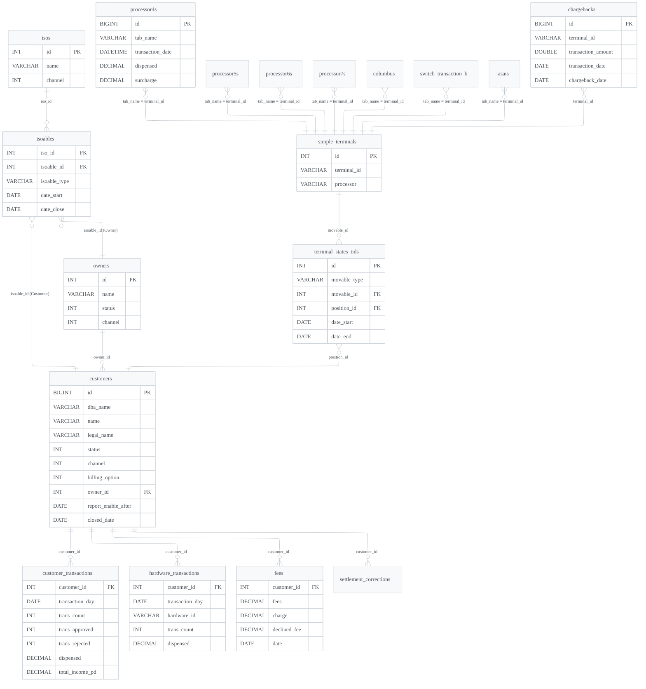

Sources: [app/models/schema_metadata.py:1-295]()

### Tablas de Entidades de Negocio

| Tabla | Propósito | Relación principal |
|---|---|---|
| `customers` | Merchants/clientes del sistema de pagos | Entidad central |
| `owners` | Entidades propietarias (multi-corp) | `owner hasMany customers` |
| `isos` | Independent Sales Organizations | Agrupan clientes y owners |
| `isoables` | Tabla pivote polimórfica ISOs ↔ customers/owners | `isoable_type` discrimina |

### Tablas de Transacciones Agregadas

| Tabla | Granularidad | Nota importante |
|---|---|---|
| `customer_transactions` | Resumen diario por cliente | Filas pre-pobladas con ceros; filtrar con `trans_count > 0 OR dispensed > 0` |
| `hardware_transactions` | Resumen diario por terminal | Misma regla de filas pre-pobladas |

### Tablas de Transacciones Individuales (Procesadores)

Todas comparten la misma estructura base: `id`, `tab_name` (TID), `transaction_date`, `processing_date`, `dispensed`, `requested`, `surcharge`, `bulk_id`.

Para vincular una transacción individual a un cliente se requiere la siguiente cadena de JOINs:

```sql
processor4s p
JOIN simple_terminals st ON st.terminal_id = p.tab_name
JOIN terminal_states_tids tst ON tst.movable_id = st.id
  AND tst.movable_type = 'App\\SimpleTerminal'
  AND tst.date_start <= p.transaction_date
  AND (tst.date_end >= DATE(p.transaction_date) OR tst.date_end IS NULL)
JOIN customers c ON c.id = tst.position_id
```

Sources: [app/models/schema_metadata.py:134-295](), [app/services/text_to_sql.py:374-395]()

### Columnas Protegidas Globales

Estas columnas están prohibidas globalmente, independientemente de la tabla:

| Columna | Razón |
|---|---|
| `account_number`, `routing_number`, `account_number_2`, `routing_number_2` | Datos bancarios |
| `ein_number` | Número de identificación fiscal |
| `card_pan`, `pan` | Datos de tarjeta (PCI) |
| `password`, `remember_token`, `api_token` | Credenciales |
| `auth_number`, `seq_nbr`, `number2` | Datos internos sensibles |
| `cvm_code`, `cvm_desc`, `trace_nbr` | Datos de verificación |
| `text2`, `text4` | Campos con datos sensibles potenciales |

Sources: [app/models/schema_metadata.py:14-24]()

### Valores de Enumeración del Dominio

| Campo | Valor | Significado |
|---|---|---|
| `channel` | 0 | TFIRST |
| `channel` | 1 | USAG |
| `channel` | 2 | PAYBOTIC |
| `channel` | 3 | SALT_MONEY |
| `status` | 1 | Activo |
| `status` | 0 | Cerrado/Inactivo |
| `billing_option` | 1 | Cashless |
| `billing_option` | 2 | PIN Debit |
| `billing_option` | 3 | Both (Ambos) |
| `chargeback_date` | `1988-11-17` | Chargeback pendiente/outstanding |

Sources: [app/models/schema_metadata.py:26-150](), [app/services/text_to_sql.py:396-410]()

### Ejemplos de Consultas (Few-Shot)

El sistema incluye 9 ejemplos de consultas que se inyectan en el prompt del LLM para mejorar la calidad de generación SQL:

| Ejemplo | Tipo de consulta | Tabla principal |
|---|---|---|
| Transacciones por cliente este mes | Resumen agregado | `customer_transactions` |
| Total dispensado última semana | Resumen global | `customer_transactions` |
| Clientes activos | Entidad simple | `customers` |
| Aprobadas vs rechazadas por rango | Resumen con JOIN | `customer_transactions` |
| Terminales con más transacciones | Hardware drill-down | `hardware_transactions` |
| Dispensado mensual por cliente | Resumen temporal | `customer_transactions` |
| Chargebacks pendientes | Filtro especial | `chargebacks` |
| Clientes por ISO | Relación polimórfica | `isoables` + `isos` |
| Últimas transacciones individuales | Detalle con JOINs | `processor4s` |

Sources: [app/models/schema_metadata.py:298-356]()

---

## Capa de Core

### Conexión a Base de Datos

La conexión a MySQL se configura mediante SQLAlchemy con los siguientes parámetros de pool:

| Parámetro | Valor | Descripción |
|---|---|---|
| `pool_recycle` | 3600 | Reciclar conexiones cada hora |
| `pool_size` | 5 | Número de conexiones permanentes |
| `max_overflow` | 10 | Conexiones adicionales permitidas |

La URL de conexión utiliza el driver `pymysql`: `mysql+pymysql://{user}:{password}@{host}:{port}/{name}`

Sources: [app/core/database.py:1-24]()

### Cliente AWS Bedrock

El módulo `bedrock_client.py` provee un cliente directo a AWS Bedrock (complementario al uso de LangChain en `TextToSQLService`). Usa la versión de API `bedrock-2023-05-31` y parámetros de generación:

| Parámetro | Valor |
|---|---|
| `max_tokens` | 4096 |
| `temperature` | 0.1 |
| `top_p` | 0.9 |

Sources: [app/core/bedrock_client.py:1-37]()

### Seguridad JWT

El módulo `security.py` implementa validación de tokens JWT compartidos con un backend Laravel. Utiliza la biblioteca `PyJWT` para decodificar tokens con la clave secreta compartida (`SECRET_KEY`) y el algoritmo `HS256`.

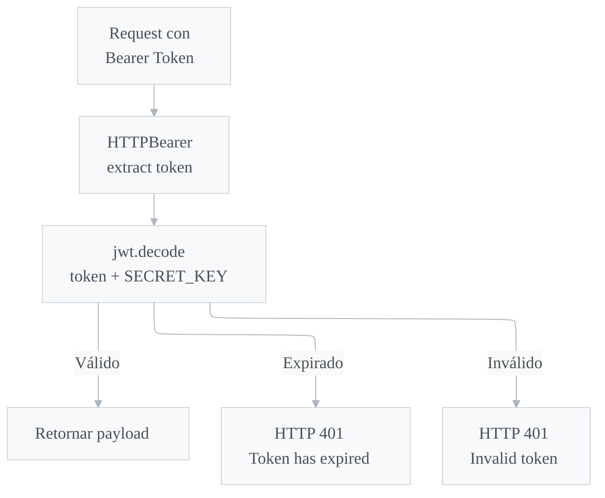

Sources: [app/core/security.py:1-27]()

### Sistema de Excepciones

El sistema define una jerarquía de excepciones personalizadas con códigos de error estructurados:

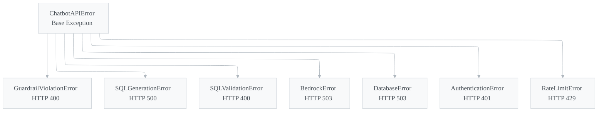

| Excepción | Código de Error | HTTP Status | Uso |
|---|---|---|---|
| `GuardrailViolationError` | `GUARDRAIL_VIOLATION` | 400 | Guardrails bloquean la solicitud |
| `SQLGenerationError` | `SQL_GENERATION_ERROR` | 500 | Fallo al generar SQL |
| `SQLValidationError` | `SQL_VALIDATION_ERROR` | 400 | SQL generado no pasa validación |
| `BedrockError` | `BEDROCK_ERROR` | 503 | Fallo de AWS Bedrock |
| `DatabaseError` | `DATABASE_ERROR` | 503 | Error de base de datos |
| `AuthenticationError` | `AUTHENTICATION_ERROR` | 401 | Fallo de autenticación |
| `RateLimitError` | `RATE_LIMIT_EXCEEDED` | 429 | Límite de tasa excedido |

Sources: [app/core/exceptions.py:1-107]()

### Logging Estructurado

El sistema implementa logging JSON estructurado con filtrado automático de datos sensibles.

**Claves sensibles redactadas automáticamente:** `password`, `token`, `api_key`, `secret`, `access_key`, `secret_key`, `authorization`, `passwd`, `pwd`, `account_number`, `routing_number`, `ein_number`, `ssn`, `credit_card`

El `JSONFormatter` genera registros con la siguiente estructura:

```json
{
  "timestamp": "2026-03-03T12:00:00Z",
  "level": "INFO",
  "logger": "chatbot_api",
  "message": "Request started",
  "module": "main",
  "function": "log_requests",
  "line": 88,
  "event": "request_started",
  "method": "POST",
  "path": "/api/v1/chat",
  "duration_ms": 1250.5
}
```

Sources: [app/core/logging_config.py:1-141]()

---

## Manejo de Errores en la Aplicación

La aplicación FastAPI registra manejadores globales de excepciones que capturan errores en toda la cadena de procesamiento:

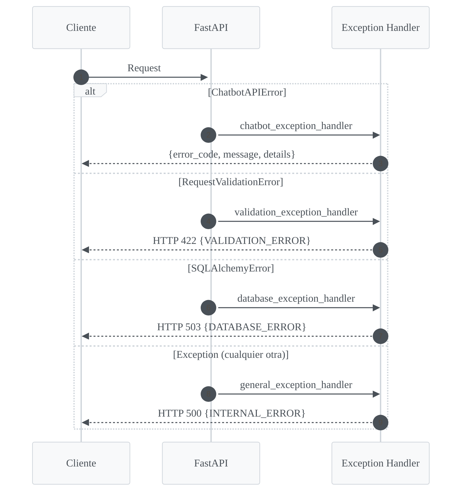

Sources: [app/main.py:25-76]()

---

## Middleware

### Middleware de Logging de Requests

Cada solicitud HTTP se registra con información de timing:

- **Request:** método, path, query params, IP del cliente
- **Response:** status code, duración en milisegundos

Sources: [app/main.py:79-112]()

### Middleware CORS

Configurado para permitir orígenes definidos en `BACKEND_CORS_ORIGINS`, con todos los métodos y headers habilitados, y soporte para credenciales.

Sources: [app/main.py:115-122]()

---

## Testing

### Tests Unitarios de Guardrails

La suite `TestGuardrailsService` valida exhaustivamente el servicio de guardrails sin dependencias externas (LLM=None):

| Categoría | Cantidad de tests | Verificación |
|---|---|---|
| Validación de tema | 5 | Longitud, temas prohibidos, columnas protegidas |
| SQL básico | 3 | Solo SELECT, keywords peligrosos |
| Columnas protegidas | 5 | `card_pan`, `pan`, `password`, `api_token`, `account_number` |
| Whitelist de columnas | 6 | Columnas válidas, COUNT(*), aliases, JOINs |
| Semicolons | 2 | Bloqueo de inyección, permite trailing `;` |
| UNION | 1 | Bloqueo total |
| Subconsultas | 1 | Bloqueo de `(SELECT ...)` |
| Tablas no autorizadas | 1 | Bloqueo de tablas fuera de SCHEMA_METADATA |
| Longitud de query | 1 | Queries > 5000 chars |
| Sanitización | 3 | Resultados vacíos, None, eliminación de columnas |

`TestSchemaMetadataConsistency` valida que los metadatos del esquema sean internamente consistentes:
- Cada columna en `ALLOWED_COLUMNS` existe en `SCHEMA_METADATA`
- Ninguna columna protegida aparece en las columnas permitidas
- Tablas y columnas críticas existen (`chargebacks` no tiene `customer_id`, etc.)

Sources: [tests/test_guardrails.py:1-340]()

### Tests de Integración

La suite `TestChatEndpointIntegration` prueba el flujo completo del endpoint usando mocks del servicio TextToSQL:

| Clase de tests | Tests | Descripción |
|---|---|---|
| `TestChatEndpointIntegration` | 3 | Health check, query exitoso, generación de session_id |
| `TestGuardrailErrorScenarios` | 3 | Datos sensibles, mensaje corto, mensaje largo |
| `TestSQLErrorScenarios` | 2 | Validación SQL, generación SQL |
| `TestValidationErrors` | 2 | Campo faltante, JSON malformado |
| `TestResponseStructure` | 2 | Estructura de éxito, estructura de error |
| `TestConcurrencyAndPerformance` | 1 | 5 requests concurrentes |

Sources: [tests/test_integration.py:1-339](), [tests/conftest.py:1-11]()

---

## Despliegue

### Docker

El `Dockerfile` utiliza un build **multi-stage** para optimizar el tamaño de la imagen:

1. **Stage builder:** Instala dependencias con `pip` en `python:3.13-slim`
2. **Stage runtime:** Copia solo las dependencias instaladas y el código de la aplicación

Características de seguridad:
- Corre como usuario no-root (`appuser`, UID 1000)
- Health check integrado con `curl`
- Puerto expuesto: 8000
- Servidor: `uvicorn`

Sources: [Dockerfile:1-46]()

### Docker Compose

Configura un servicio `chatbot-api` con:
- Mapeo de puerto `8000:8000`
- Variables de entorno desde archivo `.env`
- Health check cada 30 segundos
- Red bridge aislada (`chatbot-network`)
- Reinicio automático (`unless-stopped`)

Sources: [docker-compose.yml:1-52]()

### CI/CD con Bitbucket Pipelines

El pipeline de CI/CD consta de dos pasos en la rama `main`:

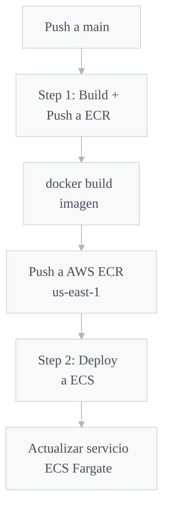

| Step | Acción | Pipe utilizado |
|---|---|---|
| Construir y subir a ECR | Build Docker + push | `atlassian/aws-ecr-push-image:2.5.0` |
| Actualizar ECS | Deploy del servicio | `atlassian/aws-ecs-deploy:1.10.0` |

**Infraestructura AWS:**
- **ECR Repository:** `chatbot-assistant-backend`
- **ECS Cluster:** `chatbot-assistant-backend-TF`
- **ECS Service:** `chatbot-service`
- **Task Family:** `chatbot-task`
- **Plataforma:** Fargate (512 CPU, 1024 MB memoria, x86_64 Linux)
- **Logs:** CloudWatch en `/ecs/chatbot-task`

Sources: [bitbucket-pipelines.yml:1-28](), [task-definition.json:1-38]()

---

## Dependencias Principales

| Dependencia | Versión | Propósito |
|---|---|---|
| `fastapi` | 0.115.6 | Framework web |
| `uvicorn` | 0.34.0 | Servidor ASGI |
| `sqlalchemy` | 2.0.36 | ORM y conexión a BD |
| `pymysql` | 1.1.1 | Driver MySQL |
| `boto3` | 1.35.94 | SDK de AWS |
| `langchain` | 0.3.13 | Framework de LLM |
| `langchain-aws` | 0.2.10 | Integración LangChain + Bedrock |
| `langchain-community` | 0.3.13 | Utilidades LangChain (SQLDatabase) |
| `pydantic` | 2.10.6 | Validación de datos |
| `pydantic-settings` | 2.7.1 | Gestión de configuración |
| `pyjwt` | 2.10.1 | Validación JWT |
| `pytest` | 8.3.4 | Framework de testing |
| `httpx` | 0.28.1 | Cliente HTTP (tests) |

Sources: [requirements.txt:1-18]()

---

## Resumen

Chatbot Assistant Backend es un sistema que combina procesamiento de lenguaje natural con acceso seguro a base de datos para un dominio de procesamiento de pagos. Sus pilares fundamentales son:

1. **Conversión Text-to-SQL** mediante Claude 3.5 Sonnet con prompts especializados y ejemplos few-shot
2. **Seguridad multicapa** con guardrails de validación de temas (LLM), validación SQL (whitelist), y sanitización de resultados
3. **Modelo de datos rico** con 17 tablas que cubren clientes, transacciones agregadas, transacciones individuales por procesador, fees, chargebacks y relaciones organizacionales (ISOs/Owners)
4. **Búsqueda inteligente de procesadores** que determina automáticamente la tabla correcta de transacciones para cada cliente
5. **Despliegue automatizado** en AWS ECS Fargate con CI/CD a través de Bitbucket Pipelines
